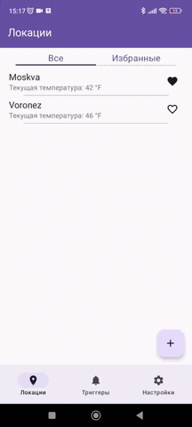

# DSR Practice
Под руководством опытного специалиста я реализовал приложение по прогнозу погоды.
Простой и лаконичный дизайн позволит Вам быстро ориентироваться в приложении, а гибкая система настроек персонализировать приложение под Вас.
Функционал предоставляет возможность отслеживать погоду в Ваших заданных локациях и добавлять их в избранное.
Система триггеров позволяет получать уведомления при достижении заданных условий.
Например, Вы можете получить уведомление при выполнении условия, что в Москве температура будет +10°C и скорость ветра 6 м/с.

# Tech Stack
Jetpack Compose, Room, Retrofit, GoogleMaps, Coroutines, Flow, Hilt, WorkManager, Glide, Data Sore

# Preview
  
